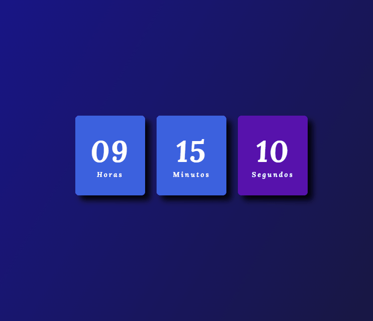

    <h1>Relógio Digital</h1>

    

  

### Um relógio digital feito com html, css e javaScript um excelente exercício para quem está começando super recomendo 👊
- HTML
- CSS
- JAVASCRIPT

### Teste você mesmo!
<a href="https://capable-cendol-55de4f.netlify.app/" target="_blank">
Clique aqui para testar relógio</a>

### Vídeo no Youtube!
<a href="https://www.youtube.com/watch?v=DIXvPcx5Vt4" target="_blank">Clique aqui para para assistir vídeo</a>

   
 

